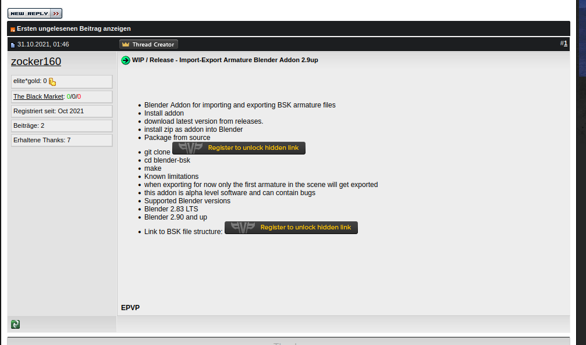

# Blender-BSK

----

## IMPORTANT NOTE:
Some idiot is impersonating me on the www.elitepvpers.com forum claiming my work as being his.

Whoever came from this post: \
https://www.elitepvpers.com/forum/sro-pserver-guides-releases/4961698-wip-release-import-export-armature-blender-addon-2-9up.html

THIS IS **NOT** ME AND PLS TELL THE FAKER TO FUCK OFF!

the original post in case it gets deleted:


[archive.org](https://web.archive.org/web/20211105211923/https://www.elitepvpers.com/forum/sro-pserver-guides-releases/4961698-wip-release-import-export-armature-blender-addon-2-9up.html)

----

Blender Addon for importing and exporting BSK armature files

### Install addon

- download latest version from [releases](https://github.com/zocker-160/blender-bsk/releases).
- install zip as addon into Blender

### Package from source

```bash
git clone https://github.com/zocker-160/blender-bsk.git
cd blender-bsk
make
```

### Known limitations

- when exporting for now only the first armature in the scene will get exported
- this addon is alpha level software and can contain bugs

### Supported Blender versions

- Blender 2.83 LTS
- Blender 2.90 and up

#### Link to BSK file structure:

https://github.com/DummkopfOfHachtenduden/SilkroadDoc/wiki/JMXVBSK
